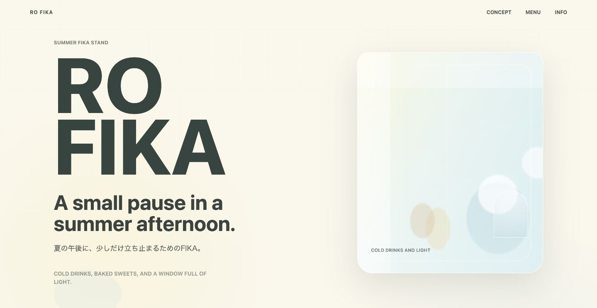
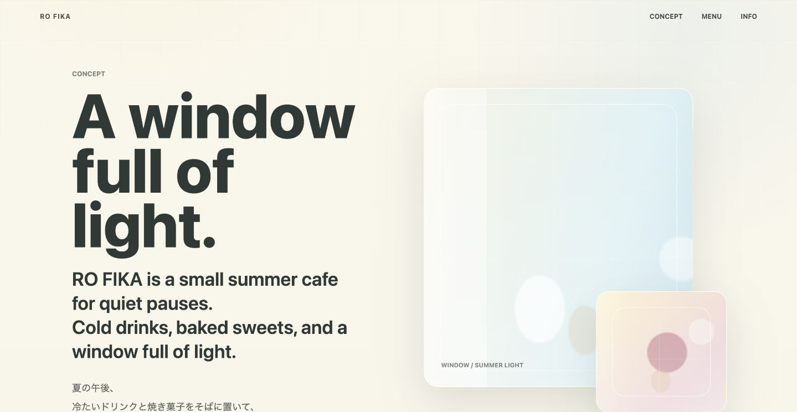
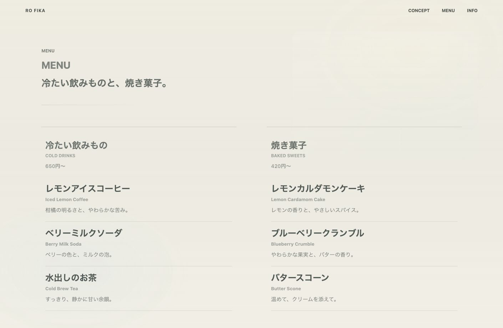
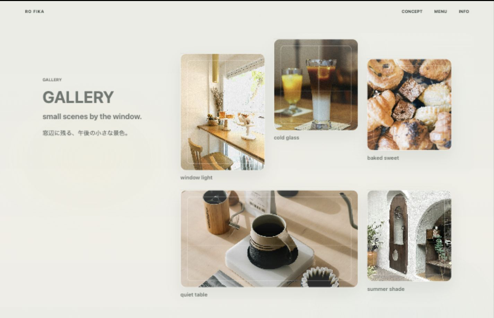
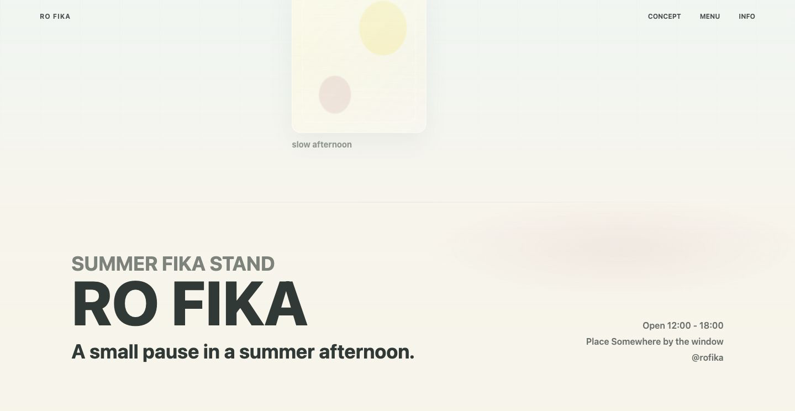
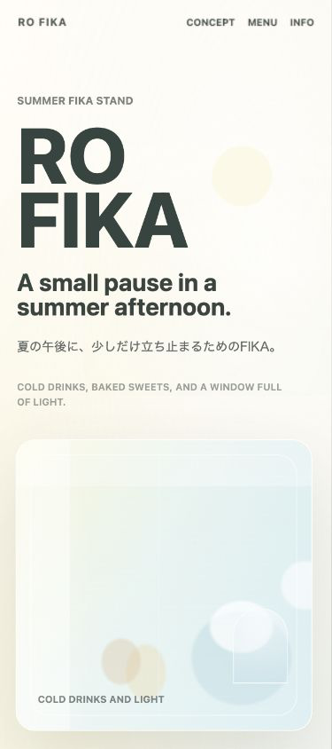
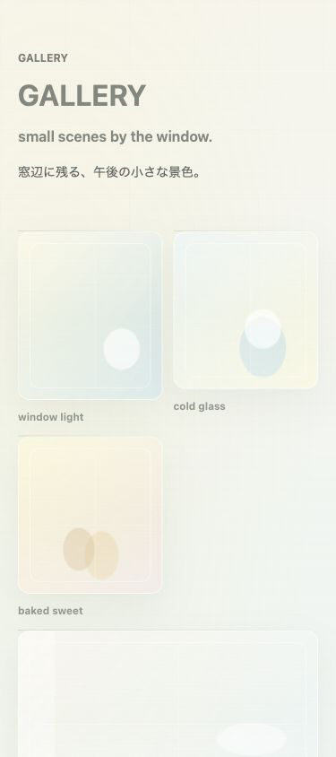
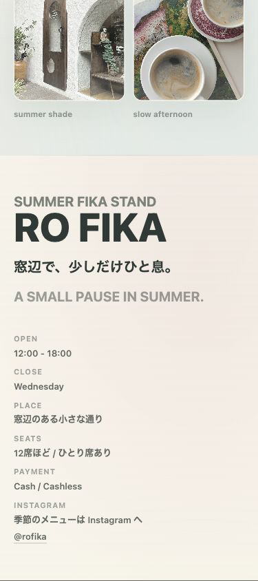

# RO FIKA

RO FIKA is a fictional one-page website for a small summer cafe.

## Live Site

https://techuueda-bot.github.io/rofika-portfolio-site/

## Overview

RO FIKAは、「架空の小さな夏のカフェ」を題材にした1ページ構成のWebサイトです。
冷たい飲みものと焼き菓子をそばに、窓辺で静かにひと息つける時間を、淡い色、余白、窓辺の光、実写真を使って表現しました。

## Portfolio Copy

余白と窓辺の光で設計した、静かな夏のカフェサイト

## Concept

光の入る、小さな夏のカフェ。

冷たい飲みものと、焼き菓子。
窓辺で、少しだけひと息。

RO FIKAでは、カフェの情報を並べるだけではなく、「ここならひとりでも静かに過ごせそう」と感じられる空気を大切にしました。

## Sections

1. Hero
   - RO FIKAの第一印象を伝える導入。
   - 大きなロゴタイプと窓辺の写真で、明るく静かなカフェ感を作っています。
2. Concept
   - 「光の入る窓辺で、ひと息。」という価値を短いコピーで説明。
   - 「ひとりで過ごす午後にも。」を加え、入りやすさも補強しています。
3. Menu
   - 冷たい飲みものと焼き菓子を、日本語中心で読みやすく整理。
   - 個別価格ではなく、飲みもの650円〜 / 焼き菓子420円〜の価格帯を添えています。
4. FIKA TIME
   - RO FIKAで過ごす時間を、短い言葉と余白で表現。
5. Gallery
   - 窓辺、グラス、焼き菓子、午後の光を感じる実写真を配置。
   - 写真の実在感を優先し、過度な動きは加えていません。
6. Footer Info
   - Open / Close / Place / Seats / Payment / Instagram を掲載。
   - Instagram導線は「季節のメニューは Instagram へ」とし、見る理由が伝わるようにしました。

## Design

- 淡い夏の色味を中心にした、明るく低彩度の配色
- 窓辺の光を感じる写真と小窓モチーフ
- 余白を広めに取った静かな構成
- 日本語コピーを主役にし、英語は小さなアクセントとして使用
- Menuは作品的にしすぎず、日本のカフェサイトとして自然に読める構成へ調整
- Galleryは実写真を使い、架空サイトでもカフェとしての実在感が出るようにしています

## Marketing Notes

完成前の調整では、見た目の雰囲気だけで終わらないように、来店前の安心感を少し足しました。

- Menuに価格帯を追加
- Footer Infoに営業時間、定休日、場所、席数、支払い、Instagramを追加
- Instagram導線を「季節のメニューは Instagram へ」に変更
- Conceptに「ひとりで過ごす午後にも。」を追加

情報を増やしすぎず、RO FIKAの静かな余白感を保ちながら、「ここなら行けそう」と感じられる最低限の実用性を目指しました。

## Implementation

- HTML / CSS / JavaScript
- 1ページ完結の縦スクロール構成
- CSS中心の軽いビジュアル表現
- `data-drift` による控えめなスクロール演出
- Galleryには `data-drift` を付けず、写真の実在感と安定性を優先
- `prefers-reduced-motion` に対応
- スマホでは文字サイズ、余白、Galleryの2列表示、Footer Infoの1列表示を調整

## Screenshots

### Hero

### Concept + Window Scene

### Menu

### FIKA Time + Gallery

### Footer Info

### Mobile View

## Quality Checks

- `h1` はHeroに1つ
- 各主要セクションは `h2` で整理
- Menu内は `h3` を使用
- Skip linkあり
- 横スクロールなし
- Footer最下部までスクロール確認済み
- コンソールエラーなし
- Gallery内 `data-drift` は0
- Chromeクラッシュなし

## Learning

この作品では、動きを増やすことよりも、静けさと見やすさを優先しました。
特にGalleryは実写真の空気感を見せる場所として扱い、スクロール演出の対象から外しています。

また、制作後半ではマーケティング視点から見直し、価格帯や店舗情報を最小限加えることで、架空サイトでありながら「カフェとして読める」状態へ整えました。
